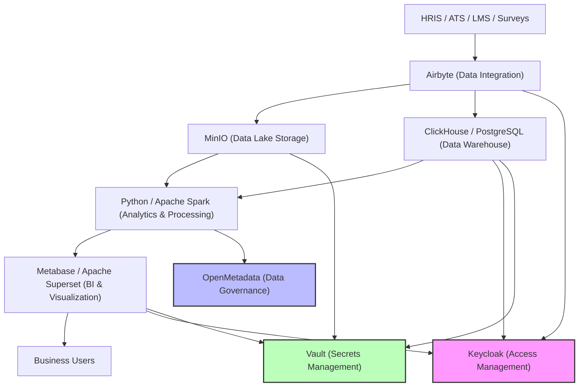

# People Analytics Architecture Diagram

## Legend
- **Airbyte**: Data integration and ingestion
- **MinIO**: Data lake for raw/unstructured data
- **ClickHouse/PostgreSQL**: Data warehouse for structured analytics
- **Python/Spark**: Analytics and processing
- **Metabase/Superset**: BI and visualization
- **OpenMetadata**: Data governance and catalog
- **Keycloak**: Access management (SSO, RBAC)
- **Vault**: Secrets management and encryption 

## Use of Data, Machine Learning (ML), and Artificial Intelligence (AI)

### Data
- Centralizes and integrates data from multiple HR sources (HRIS, ATS, LMS, surveys, etc.)
- Enables comprehensive, accurate, and up-to-date reporting and analytics
- Supports data-driven decision-making across HR and business functions

### Machine Learning (ML)
- Predicts employee turnover, flight risk, and retention drivers
- Identifies high-potential talent and succession planning candidates
- Analyzes engagement survey results to uncover hidden patterns
- Forecasts workforce needs and skills gaps
- Automates anomaly detection in HR data (e.g., payroll, attendance)

### Artificial Intelligence (AI)
- Powers natural language queries and chatbots for HR analytics self-service
- Recommends personalized learning and development paths
- Enhances diversity, equity, and inclusion (DEI) analysis with advanced pattern recognition
- Supports sentiment analysis from open-ended survey responses and communications
- Enables scenario modeling and what-if analysis for workforce planning

### Benefits
- Improves accuracy and speed of HR insights
- Enables proactive, rather than reactive, HR strategies
- Reduces manual effort in data analysis and reporting
- Supports fair, unbiased, and transparent people decisions
- Drives measurable business outcomes through smarter workforce management 